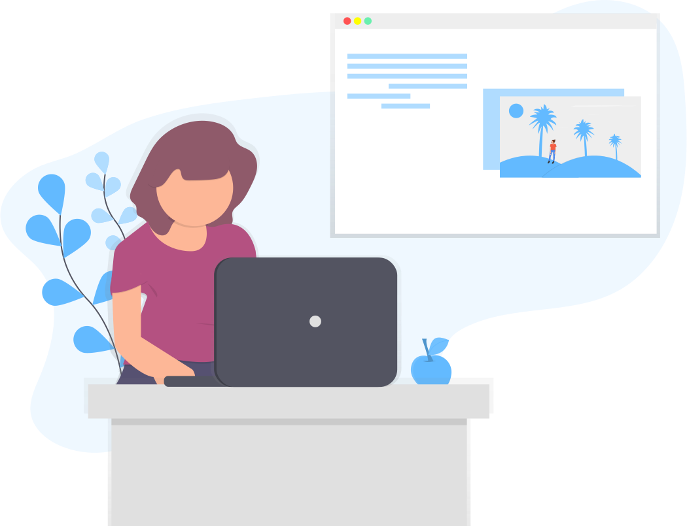

## musings-api

    Musings sphere to share amazing ideas and articles with the rest of the world.

#### Simple but complicated musings

## Description

This application will be used in a hydroponics farm control system to be used at home with limited space, in greenhouses and indoors as well.

This is a [Next.js](https://nextjs.org/) project bootstrapped with [`create-next-app`](https://github.com/vercel/next.js/tree/canary/packages/create-next-app).
